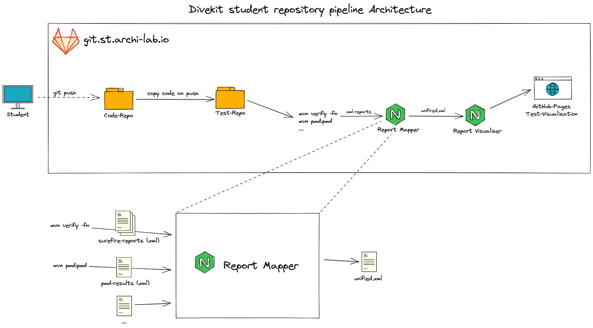

## Architecture overview


## Usage in the pipeline
For the usage in the pipeline you just need `node` as prerequisite and then install and use the report-mapper as following:
```bash
npm install @divekit/report-mapper
npx report-mapper
```
Keep in mind, to provide needed input-data based on your [configuration](#configuration).

### Complete sample test-repo pipeline-script
```yml
image: maven:3-jdk-11

stages:
  - build
  - deploy

build: # Build test reports
  stage: build
  script:
    - chmod ugo+x ./setup-test-environment.sh
    - ./setup-test-environment.sh # copy code from code repo and ensure that test are NOT overridden
    - mvn pmd:pmd # build clean code report
    - mvn verify -fn # always return status code 0 => Continue with the next stage
  allow_failure: true
  artifacts: # keep reports for the next stage
    paths:
      - target/pmd.xml
      - target/surefire-reports/TEST-*.xml

pages: # gather reports and visualize via gitlab-pages
  image: node:latest
  stage: deploy
  script:
    - npm install @divekit/report-mapper
    - npx report-mapper # run generate unified.xml file
    - npm install @divekit/report-visualizer
    - npx report-visualizer --title $CI_PROJECT_NAME # generate page

  artifacts:
    paths:
      - public
  only:
    - master

```
### configuration
The report mapper is configurable in two main ways:
1. By defining which inputs are expected and therefore should be computed.
   This is configurable via parameters. You can choose from the following: pmd, checkstyle* and surefire.
   If none are provided it defaults to surefire and pmd.
```bash
npx report-mapper [surefire pmd checkstyle]
```
2. The second option is specific to PMD. PMD for itself has a configuration-file `pmd-ruleset.xml` which configures 
   which PMD rules should be checked. The report mapper also reads from this file and will design the 
   output based on available rules.
   <br> _Note: The assignment of PMD rules to clean code and solid principles is as of now hardcoded and not configurable._


_*The checkstyle-mapper is currently not included in the testing and therefore should be used with caution._

Example simplified `pmd-ruleset.xml`:
```xml
<?xml version="1.0"?>
<ruleset name="Custom Rules"
         xmlns="http://pmd.sourceforge.net/ruleset/2.0.0"
         xmlns:xsi="http://www.w3.org/2001/XMLSchema-instance"
         xsi:schemaLocation="http://pmd.sourceforge.net/ruleset/2.0.0 https://pmd.sourceforge.io/ruleset_2_0_0.xsd">
  <description>
    Clean Code Rules
  </description>

  <!-- :::::: CLEAN CODE :::::: -->
  <!-- Naming rules -->
  <rule ref="category/java/codestyle.xml/ClassNamingConventions"/>
  <rule ref="category/java/codestyle.xml/FieldNamingConventions"/>

  <!-- :::::::: SOLID :::::::: -->
  <!-- SRP (Single Responsibility Principle) rules -->
  <rule ref="category/java/design.xml/TooManyFields"/> <!-- default 15 fields -->
  <rule ref="category/java/design.xml/TooManyMethods"> <!-- default is 10 methods -->
    <properties>
      <property name="maxmethods" value="15" />
    </properties>
  </rule>
</ruleset>

```

## Getting started

### Install
Clone the repository and install everything necessary:

```bash
# HTTP
git clone https://github.com/divekit/divekit-report-mapper.git
# SSH
git clone git@github.com:divekit/divekit-report-mapper.git

cd ./divekit-report-mapper

npm ci # install all dependencies

npm test # check that everything works as intended
```

### Provide input data
The input data should be provided in the following structure:
```
divekit-report-mapper
├── target
|   ├── surefire-reports
|   |    ├── fileA.xml
|   |    └── fileB.xml
|   ├── checkstyle-result.xml
|   └── pmd.xml
└── ...
```
_You can find some examples for valid and invalid inputs in the tests: `src/test/resources`_

```bash
npm run dev
```

### Understand the Output

The result from the divekit-report-mapper is a XML-File (`target/unified.xml`).
It contains the result of all inputs sources in a uniform format. This also includes errors if some or all inputs
provided invalid or unexpected data.

Example with only valid data:
```xml
<?xml version="1.0" encoding="UTF-8"?>
<suites>
  <testsuite xmlns:xsi="http://www.w3.org/2001/XMLSchema-instance" xsi:noNamespaceSchemaLocation=""
             name="E2CleanCodeSolidManualTest" failures="0" type="JUnit" status="failed">
    <testcase name="testCleanCodeAndSolidReview" status="failed" hidden="false">
      <error message="-%20break%20pipeline%20%3C--%0A" type="java.lang.Exception"><![CDATA[java.lang.Exception:
                - break pipeline <--
            	at thkoeln.st.st2praktikum.exercise1.E2CleanCodeSolidManualTest.testCleanCodeAndSolidReview(E2CleanCodeSolidManualTest.java:13)]]>
      </error>
    </testcase>
  </testsuite>

  <testsuite name="Clean-Code-Principles by PMD" status="failed" type="CleanCode">
    <testcase name="Keep it simple, stupid" status="passed" hidden="false"></testcase>
    <testcase name="Meaningful names" status="failed" hidden="false">
      <error type="LocalVariableNamingConventions" location="Line: 90 - 90 Column: 13 - 22"
             file="C:\work\gitlab-repos\ST2MS0_tests_group_d5535b06-ae29-4668-8ad9-bd23b4cc5218\src\main\java\thkoeln\st\st2praktikum\bad_stuff\Robot.java"
             message="The local variable name &apos;snake_case&apos; doesn&apos;t match &apos;[a-z][a-zA-Z0-9]*&apos;"></error>
    </testcase>
  </testsuite>

</suites>
```

For further examples see tests `src/test/resources`.

### Deployment
All pipeline scripts normally use the latest version from
[npmjs.com](https://www.npmjs.com/package/@divekit/report-mapper).

The repository is set up with three different GitHub Actions workflows wich trigger 
on pushes to the branches `main`, `stage` and `development`.

- main: Build, run tests and publish new npm package. Fails if:
  build/tests fail, the version is a beta version or
  the version has not been updated
- stage: same as main but the version must be a beta-version and the package is
  tagged as beta
- development: Build and run all tests

## Version
Complete packages available at [npmjs.com](https://www.npmjs.com/package/@divekit/report-mapper).
The versioning is mostly based on [semantic versioning](https://semver.org/lang/de/).

### 1.1.1

### 1.0.9-beta.1

- update scripts according to new report-visualizer naming

### 1.0.8

- Parameters processing added, which allow a restriction of the used mappers
- Error handling: If a mapper does not deliver a valid result, an error is indicated in the unified.xml. 
