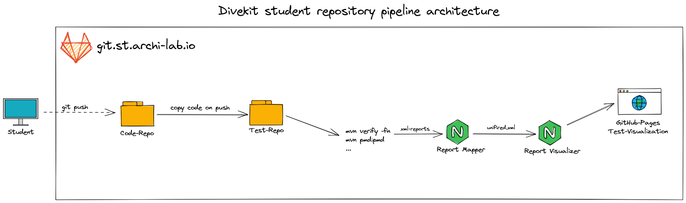
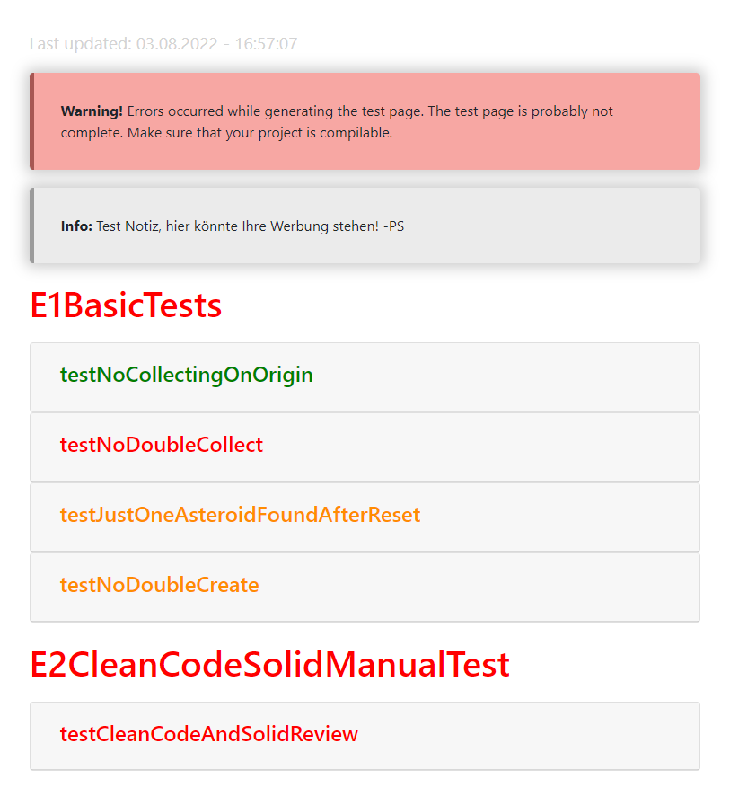

## Architecture overview


## Usage in the pipeline
For the usage in the pipeline you just need `node` as prerequisite and provide the input-data: `target/unified.xml`.
Install and use the report-visualizer as following:
```bash
npm install @divekit/report-visualizer
npx report-visualizer --title PROJECT_NAME
```

### Complete sample test-repo pipeline-script
```yml
image: maven:3-jdk-11

stages:
  - build
  - deploy

build: # Build test reports
  stage: build
  script:
    - chmod ugo+x ./setup-test-environment.sh
    - ./setup-test-environment.sh # copy code from code repo and ensure that test are NOT overridden
    - mvn pmd:pmd # build clean code report
    - mvn verify -fn # always return status code 0 => Continue with the next stage
  allow_failure: true
  artifacts: # keep reports for the next stage
    paths:
      - target/pmd.xml
      - target/surefire-reports/TEST-*.xml

pages: # gather reports and visualize via gitlab-pages
  image: node:latest
  stage: deploy
  script:
    - npm install @divekit/report-mapper
    - npx report-mapper # run generate unified.xml file
    - npm install @divekit/report-visualizer
    - npx report-visualizer --title $CI_PROJECT_NAME # generate page

  artifacts:
    paths:
      - public
  only:
    - master

```

## Getting started

### Install
Clone the repository and install everything necessary:

```bash
# HTTP
git clone https://github.com/divekit/divekit-report-visualizer.git
# SSH
git clone git@github.com:divekit/divekit-report-visualizer.git

cd ./divekit-report-visualizer

npm ci # install all dependencies
```

### Provide input data
The input data should be provided in the following structure:
```
divekit-report-visualizer
├── target
|   └── unified.xml
└── ...
```

### Run it
Directly with provided input `target/unified.xml`
```bash
node bin/report-visualizer
```
Use predefined input `assets/xml-examples/unified.xml`
```bash
npm run dev
```
Or use `divekit-report-mapper` result*
```bash
npm run dev++
```

_*Requirement is that the `divekit-report-visualizer` is located in the same directory as the `divekit-report-mapper`._

### Output (GitLab Pages)
Output in `/public` directory. Which is used for GitLab-pages or could be mounted anywhere.
```
divekit-report-visualizer
├── target
|   └── unified.xml
├── public
|   ├── index.html
|   └── style.css
└── ...
```

The following picture shows an example output with passed test (green), test failures (orange),
errors (red) and a note (gray).

<!-- TODO provide image with Testsuite, Notes, Errors -->


### Deployment
Currently, completely manually. In the future done similar to [report-mapper](../report-mapper) 

All pipeline scripts normally use the latest version from
[npmjs.com](https://www.npmjs.com/package/@divekit/report-mapper).

## Version
Complete packages available at [npmjs.com](https://www.npmjs.com/package/@divekit/report-mapper).
The versioning is mostly based on [semantic versioning](https://semver.org/lang/de/).

### 1.0.3
- Updating naming: form `divekit-new-test-page-generator` to `divekit-report-visualizer`

### 1.0.2

- Added hidden metadata in the header indicating the number of failed tests.
- Added possibility to pass a special 'NoteTest' test case which is displayed separately.
- Updated the error message for generation problems so that it is displayed even if only parts of the test page
  could not be generated.
- Fixed an error where the test page could not be generated if there was no input.
