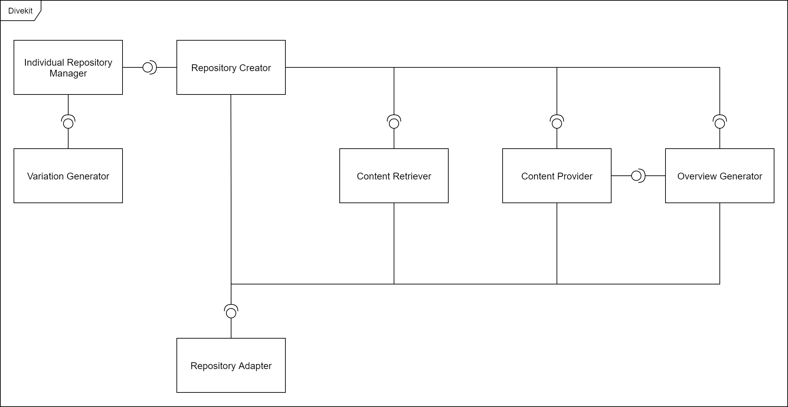

## Setup & Run

1. Install NodeJs (version >= 12.0.0) which is required to run this tool. NodeJs can be acquired on the
   website [nodejs.org](https://nodejs.org/en/download/).
2. To use this tool you have to clone [the repository](https://github.com/divekit/divekit-automated-repo-setup) to your
   local drive.
3. This tool uses several libraries in order to use the Gitlab API etc. Install these libraries by running the
   command ```npm install``` in the root folder of this project.
4. Local/GitLab usage
    1. For local use only
        1. Copy the origin repository into the folder *resources/test/input*. If this folder does not exist, create the
         folder *test* inside the *resources* folder and then create the folder *input* in the newly created folder *test*
        2. The generated repositories will be located under *resources/test/output* after running the tool
    2. For use with Gitlab:
        1. Navigate to https://git.st.archi-lab.io/profile/personal_access_tokens (if you are using the gitlab instance *
        git.st.archi-lab.io*) and generate an Access Token / API-Token in order to get access to the gitlab api
        2. Copy the Access Token
        3. Rename the file .env.example to .env
        4. Open .env and replace *YOUR_API_TOKEN* with the token you copied.
        5. Configure the source repository and target group in the config

5. Before you can configure or run this tool you have to copy all the example config files inside the *
         resources/examples/config* folder to the *resources/config* folder in order to create your own config files. If you
         want to change the standard behaviour you can configure this tool by editing the configs.

6. To run the application navigate into the root folder of this tool and run ```npm start```. The repositories will now
            be generated.

## Configuration

Before you can configure this tool you have to copy all the relevant example config files inside the *
resources/examples/config* folder to the *resources/config* folder in order to create your own config files. If you want
to change the standard behaviour you can configure this tool by editing the configs.

The Divekit uses two types of configs, technical configs and domain specific configs. The contents of technical configs
often change each time repositories are generated using the Divekit. Therefore these type of configs are located in
the *resources/config* folder of the Divekit. Domain configs do not change each time new repositories are generated
because they depend on the type of exercise and the corresponding domain. As a result these configs should be contained
in the Origin Project (they dont have to). In the following the different configs, their purpose and their type are
listed:

| Config                   | Purpose                                                                         | Type             |
|--------------------------|---------------------------------------------------------------------------------|------------------|
| repositoryConfig         | Configure the process of repository generation                                  | Technical Config |
| originRepositoryConfig   | Configure solution deletion and variable warnings                               | Domain Config    |
| variationsConfig         | Configure different types of variations                                         | Domain Config    |
| variableExtensionsConfig | Configure different extensions which are used to generate derivated variables   | Domain Config    |
| relationsConfig          | Configure properties of relations which are used to generate relation variables | Domain Config    |

## Features

### Repository Generation

If the Divekit is run the tool will generate repositories based on the configured options defined in the *
repositoryConfig*. The following example shows the relevant options where each option is explained in short:

```
{
    "general": {
        # Decide wheather you just want to test locally. If set to false the Gitlab api will be used
        "localMode": true,

        # Decide wheather test repositories should be generated as well. If set to false there will only be generated one code repository for each learner
        "createTestRepository": true,

        # Decide wheather the repositories should be randomized using the *variationsConfig.json*
        "variateRepositories": true,

        # Decide wheather the existing solution should be deleted using the SolutionDeleter
        "deleteSolution": false,

        # Activate warnings which will warn you if there are suspicious variable values remaining after variable placeholders have been replaced
        "activateVariableValueWarnings": true,

        # Define the number of concurrent repository generation processes. Keep in mind that high numbers can overload the Gitlab server if localMode is set to false
        "maxConcurrentWorkers": 1
        
        # Optional flag: set the logging level. Valid values are "debug", "info", "warn", "error" (case insensitive). Default value is "info".
        "globalLogLevel": "debug"
    },
    "repository": {
        # The Name of the repositories. Multiple repositories will be named <repositoryName>_group_<uuid>, <repositoryName>_tests_group_<uuid> ...
        "repositoryName": "st2-praktikum",

        # The number of repositories which will be created. Only relevant if there were no repositoryMembers defined
        "repositoryCount": 0,

        # The user names of the members which get access to repositories
        "repositoryMembers": [
            ["st2-praktikum"]
        ]
    },
    "local": {
        # The file path to an origin repository which should be used for local testing
        "originRepositoryFilePath": ""
    },
    "remote": {
        # Id of the repository you want to clone
        "originRepositoryId": 1012,

        # The ids of the target groups where all repositories will be located
        "codeRepositoryTargetGroupId": 161,
        "testRepositoryTargetGroupId": 170,

        # If set to true all existing repositories inside the defined groups will be deleted
        "deleteExistingRepositories": false,

        # Define wheather users are added as maintainers or as quests
        "addUsersAsGuests": false
    }
}
```

If *localMode* is set to true the application will only generate possible variable variations and randomize files based
on a folder which contains the origin repository. This folder should be located in the folder *resources/test/input*. If
the folder *resources/test/input* does not exist create it within the root folder of this tool or run the tool once in
test mode which will generate this folder automatically. This can be used to get an idea which repositories will result
based on the configs. The following example shows the location of the origin folder:

```
root_of_tool
    - build
    - node_modules
    - src
    - .gitignore
    - .Readme
    - resources
        - test
            - input
                - origin-folder
                    - src
                    - .gitignore
                    - .Readme
```

If you dont want to copy the origin repository each time you want to test a new version specify the file path to the
origin repository in the config under *local.originRepositoryFilePath*.

### Partially repository generation
While running the `automated-repo-setup` in local mode you have the option to partially generate repositories.

To do so, just configure the `repositoryConfig.json`* as such:
```json
{
    "general": {
        "localMode": true
    },
    "local": {
        "subsetPaths": [
          "README.md",
          "path/to/malfunction/file.eof"
        ]
    }
}
```
**only partially shown*

Start generation
```bash
npm start
```

Generated files are located under: `resources/output/`

## File Assignment

Although code and test files are separeted into two repositories the exercise only consists of one repository called the
origin. It would be really troublesome if you would have to update two repositories all the time while creating a new
exercise. Because of that there has to be a way to determine wheather a file has to be copied to the code project, the
test project or both. If you want some files to only be copied to a specific repository you can express this behaviour
in the filename.

- If the filename contains the string *_coderepo* the file will only be copied to the code repository.
- If the filename contains the string *_testrepo* the file will only be copied to the test repository.
- If the filename contains the string *_norepo* the file will not be copied to the repositories. This can be used to
  store config files from this tool directly in the origin repository.
- If the filename contains none of those the file will be copied to both repositories.


## File Converter

If you want to convert or manipulate certain repository files during the repository generation process *File
Converters* (*File Manipulators*) can be used. Currently there is only one type of File Manipulator available.
Additional converters can be easily added by extending the codebase of the Divekit. The already existing File
Manipulartor is called *UmletFileManipulator*. This manupulator is used to convert the individualized xml
representations of [Umlet](https://www.umlet.com/) diagrams to image formats. This convert step can not be skipped
because it is not possible to replace variables in image representations of umlet diagrams. Therefore the process of
individualizing UML diagrams created with umlet is as follows:

UML diagram with placeholder variables (xml) -> UML diagram with already replaced content (xml) -> UML diagram with
already replaced content (image file format) 


## Test Overview

To give an overview on passed and failed tests of a repository a test overview page will be generated using the project
[report-mapper](../report-mapper/.)  and  [report-visualizer](../report-visualizer/.). The tools are called within the "
.gitlab-ci.yml" file in the deploy stage.

## Repository Overview

If you have the generation of the overview table enabled in the *repositoryConfig* the destination and the name of the
overview table can be defined in the file *repositoryConfig* as well:

```json
{
    "overview": {
        "generateOverview": true,
        "overviewRepositoryId": 1018,
        "overviewFileName": "st2-praktikum"
    }
}
```

Given the config shown above a markdown file will be generated which includes a summary of all generated repositories
and their members. After that the file will be uploaded to the configured repository:

| Group | Code Repo                         | Test Repo                               | Test Page                                     |
|-------|-----------------------------------|-----------------------------------------|-----------------------------------------------|
| user1 | https://example.com/folder1/repo1 | https://example.com/folder1/tests/repo1 | https://pages.example.com/folder1/tests/repo1 |
| user2 | https://example.com/folder1/repo2 | https://example.com/folder1/tests/repo2 | https://pages.example.com/folder1/tests/repo2 |
| user3 | https://example.com/folder1/repo3 | https://example.com/folder1/tests/repo3 | https://pages.example.com/folder1/tests/repo3 |


## Solution Deletion

If you want solutions which are contained in your origin project to be removed while creating the code and test
repositories enable solution deletion in the *repositoryConfig*. The *originRepositoryConfig* specifies the keywords
which are used to either

- delete a file
- delete a paragraph
- replace a paragraph

This can be shown best with an example:

```java
// TODO calculate the sum of number 1 and number 2 and return the result
public static int sumInt(int number1, int number2) {
    //unsup
    return number1 + number2;
    //unsup
}

// TODO calculate the product of number 1 and number 2 and return the result
public static int multiplyInt(int number1, int number2) {
    //delete
    return number1 * number2;
    //delete
}
```

will be changed to:


```java
// TODO calculate the sum of number 1 and number 2 and return the result
public static int sumInt(int number1, int number2) {
    throw new UnsupportedOperationException();
}

// TODO calculate the product of number 1 and number 2 and return the result
public static int multiplyInt(int number1, int number2) {
    
}
```

The corresponding config entry in the *originRepositoryConfig* would be:

```json
{
    "solutionDeletion": {
        "deleteFileKey": "//deleteFile",
        "deleteParagraphKey": "//delete",
        "replaceMap": {
            "//unsup": "throw new UnsupportedOperationException();"
        }
    }
}
```

A file containing the string "//deleteFile" would be deleted.


## Individualization

If you want your project to be randomized slightly use the configuration files *variationsConfig.json*, *
variableExtensionsConfig* and *relationsConfig* to create variables. Variables can be referenced later by their name
encapsulated in configured signs. e.g.: $ThisIsAVariable$.

### Variable Generation

There are three types of variables:

### Object Variables

*Object Variables* are used to randomize Entities and Value Objects. Such variables are created by defining one or
multiple ids and an array of possible object variations. Object variations can contain attributes which will later be
transformed into a variable. An example attribute could be *Class* which contains the class name of an entity. Keep in
mind that attributes can not only be limited to a single primitive value but can only be expressed as a new object
inside the json. The following json shows a possible declaration of two object variations inside the *variationsConfig*:

 ```json
{
  "ids": "Vehicle",
  "objectVariations": [
    {
      "id": "Car",
      "Class": "Car",
      "RepoClass": "CarRepository",
      "SetToOne": "setCar",
      "SetToMany": "setCars"
    },
    {
      "id": "Truck",
      "Class": "Truck",
      "RepoClass": "TruckRepository",
      "SetToOne": "setTruck",
      "SetToMany": "setTrucks"
    },
    {
      "id": "Train",
      "Class": "Train",
      "RepoClass": "TrainRepository",
      "SetToOne": "setTrain",
      "SetToMany": "setTrains"
    }
  ],
  "variableExtensions": [
    "Getter"
  ]
},
{
"ids": ["Wheel1", "Wheel2"],
"objectVariations": [
{
"id": "FrontWheel",
"Class": "FrontWheel",
"RepoClass": "FrontWheelRepository",
"SetToOne": "setFrontWheel",
"SetToMany": "setFrontWheels"
},
{
"id": "BackWheel",
"Class": "BackWheel",
"RepoClass": "BackWheelRepository",
"SetToOne": "setBackWheel",
"SetToMany": "setBackWheels"
}
],
"variableExtensions": ["Getter"]
}
 ```

The defined object variations are now randomly assigned to the variables *Vehicle*, *Wheel1* and *Wheel2*. The following
dictionary shows variables which result from above declaration:

 ```
VehicleClass: 'Truck',
VehicleRepoClass: 'TruckRepository',
VehicleGetToOne: 'getTruck',
VehicleGetToMany: 'getTrucks',
VehicleSetToOne: 'setTruck',
VehicleSetToMany: 'setTrucks',
Wheel1Class: 'Backwheel',
Wheel1RepoClass: 'BackwheelRepository',
Wheel1GetToOne: 'getBackWheel',
Wheel1GetToMany: 'getBackWheels',
Wheel1SetToOne: 'setBackWheel',
Wheel1SetToMany: 'setBackWheels',
Wheel2Class: 'FrontWheel',
Wheel2RepoClass: 'FrontWheelRepository',
Wheel2GetToOne: 'getFrontWheel',
Wheel2GetToMany: 'getFrontWheels',
Wheel2SetToOne: 'setFrontWheel',
Wheel2SetToMany: 'setFrontWheels'
 ```

In the example above you can see that some variables could be derived from already existing variables. The *setter*
variables are a perfect example for this. Such variables can also be defined through variable extensions. This is done
for the *getter* variables in the example. Two steps are required to define such derived variables:

1. Define a rule for a variable extension in the config *variableExtensionsConfig.json*:

 ```json
{
  "id": "Getter",
  "variableExtensions": {
    "GetToOne": {
      "preValue": "get",
      "value": "CLASS",
      "postValue": "",
      "modifier": "NONE"
    },
    "GetToMany": {
      "preValue": "get",
      "value": "PLURAL",
      "postValue": "",
      "modifier": "NONE"
    }
  }
}
 ```

The *value* attribute references an already existing variable which is modified through the given *modifier*. Valid
modifiers can for example convert the given variable to an all lower case variant.

The resulting value is then concatenated with the *preValue* and *postValue* like so: preValue + modifier(value) +
postValue.

2. Define a certain variable extension for an object by adding the id of the variable extension to the list of variable
   extensions of an object (see example above).

#### Relation Variables

*Relation Variables* are used to randomize relations between entities. They are defined by declaring an array of *
relationships* and an array of *relationObjects* inside the *variationsConfig*. Both arrays must be of equal length
because each set of relationObjects will be assigned to an relationShip.

In order to define a relationShip you have to provide an id and a reference to an relationShip type. These types are
defined in the file *relationsConfig* and can contain any kind of attributes:

 ```json
{
  "id": "OneToOne",
  "Umlet": "lt=-\nm1=1\nm2=1",
  "Short": "1 - 1",
  "Description": "one to one"
}
 ```

In order to define a set of relationObjects you have to provide an id and two object references. The following json
shows an example definition for relations:

 ```json
{
  "relationShips": [
    {
      "id": "Rel1",
      "relationType": "OneToOne"
    },
    {
      "id": "Rel2",
      "relationType": "OneToMany"
    }
  ],
  "relationObjects": [
    {
      "id": "RelVehicleWheel1",
      "Obj1": "Vehicle",
      "Obj2": "Wheel1"
    },
    {
      "id": "RelVehicleWheel2",
      "Obj1": "Vehicle",
      "Obj2": "Wheel2"
    }
  ]
}
 ```

For each relationship two kind of variables will be generated.

- One kind of variable will clarify which objects belong to a certain relationship. These variables will start with for
  example *Rel1* as defined in the section *relationShips*.

- Another kind of variable will clarify which relationship belongs to a set of objects. These variables will start with
  for example *RelVehicleWheel1* as defined in the section *relationObjects*.

For each of these two kinds a set of variables will be gernated. The first set contains attributes of the relation types
defined in the *relationsConfig*. The other set contains attributes of the objects defined in the *variationsConfig*.

The following json shows a set of variables which will be generated for a single relationship:

```
Rel1_Umlet: 'lt=-\nm1=1\nm2=1',
Rel1_Short: '1 - 1',
Rel1_Description: 'one to one',
Rel1_Obj1Class: 'Truck',
Rel1_Obj1RepoClass: 'TruckRepository',
Rel1_Obj1GetToOne: 'getTruck',
Rel1_Obj1GetToMany: 'getTrucks',
Rel1_Obj1SetToOne: 'setTruck',
Rel1_Obj1SetToMany: 'setTrucks',
Rel1_Obj2Class: 'Backwheel',
Rel1_Obj2RepoClass: 'BackwheelRepository',
Rel1_Obj2GetToOne: 'getBackWheel',
Rel1_Obj2GetToMany: 'getBackWheels',
Rel1_Obj2SetToOne: 'setBackWheel',
Rel1_Obj2SetToMany: 'setBackWheels',

RelVehicleWheel1_Umlet: 'lt=-\nm1=1\nm2=1',
RelVehicleWheel1_Short: '1 - 1',
RelVehicleWheel1_Description: 'one to one',
RelVehicleWheel1_Obj1Class: 'Truck',
RelVehicleWheel1_Obj1RepoClass: 'TruckRepository',
RelVehicleWheel1_Obj1GetToOne: 'getTruck',
RelVehicleWheel1_Obj1GetToMany: 'getTrucks',
RelVehicleWheel1_Obj1SetToOne: 'setTruck',
RelVehicleWheel1_Obj1SetToMany: 'setTrucks',
RelVehicleWheel1_Obj2Class: 'Backwheel',
RelVehicleWheel1_Obj2RepoClass: 'BackwheelRepository',
RelVehicleWheel1_Obj2GetToOne: 'getBackWheel',
RelVehicleWheel1_Obj2GetToMany: 'getBackWheels',
RelVehicleWheel1_Obj2SetToOne: 'setBackWheel',
RelVehicleWheel1_Obj2SetToMany: 'setBackWheels',
```

#### Logic variables

*Logic Variables* are used to randomize logic elements of an exercise. The idea behind this concept is that you can
define multiple groups of business logic, but only one group of business logic is assigned to each individual exercise.
Logic variables can also be used to define text which decribes a certain business logic. Here is an example for the
definition of logic variables:

```json
{
  "id": "VehicleLogic",
  "logicVariations": [
    {
      "id": "VehicleCrash",
      "Description": "Keep in mind that this text is just an example. \nThis is a new line"
    },
    {
      "id": "VehicleShop",
      "Description": "The Vehicle Shop exercise was selected"
    }
  ]
}
```

Above example will generate only one variable which is called *VehicleLogicDescription*. The interesting part of the
logic variations are the *ids*. If you add an *underscore* followed by such an *id* to the end of a file this file is
only inserted into an individual repository if the said id was selected during the randomization.

e.g.: The file VehicleCrashTest_VehicleCrash.java is only inserted if the logic *VehicleCrash* was selected. The file
VehicleShopTest_VehicleShop.java is only inserted if the logic *VehicleShop* was selected.

This can be used to dynamically insert certain test classes which test a specific business logic. If a certain test
class was not inserted to an individual repository the one who solves this exercise does not have to implement the
corresponding business logic.

### Variable Post Processing

Often variable values are needed not only in capital letters but also in lower case format. Therefore for each generated
variable there will be three different types generated:

1. The first type is the variable itselt without further changes e.g.: VehicleClass -> MonsterTruck

2. The second type sets the first char to lower case e.g.: vehicleClass -> monsterTruck

3. The third type sets all chars to lower case e.g.: vehicleclass -> monstertruck

### Variable Replacement

In the process of repository individualization all defined variables will be replaced in all the origin repository files
with their corresponding value. Typically every variable which should be replaced is decorated with a specific string at
the start and the end of the variable e.g: $VehicleClass$ or xxxVehicleClassxxx. This string helps identifying
variables. If needed this string can be set to an empty string. In this case the variable name can be inserted in
specific files without futher decoration. This can lead to problems in terms of variable replacement so that the Divekit
will take certain measures to ensure that all variables are replaced correctly. This decoration string can be configured
in the *originRepositoryConfig*:

```json
{
    "variables": {
        "variableDelimeter": "$"
    }
}
```

### Variable Value Warnings

If this feature is activated within the *repositoryConfig* the tool will spit out warnings which will inform you if
there are suspicious variable values remaining after variable placeholders have been replaced. If for example a learner
has to solve an exercise which contains Trucks instead of Cars (see config above) then the solution of this leaner
should not contain variable values like "Car", "CarRepository", "setCar" or "setCars". In the *originRepositoryConfig*
you can define a whitelist of file types which should be included in the warning process. 

Additionally an *ignoreList* can be configured. If a variable value is contained in one of the defined values inside 
the ignoreList this specific variable value will not trigger a warning. In addition, the *ignoreFileList* can 
contain filenames which should be completely excluded from the warning process.


The following json is an example for the discussed configurable options:

```json
{
    "warnings": {
        "variableValueWarnings": {
            "typeWhiteList": [
                "json",
                "java",
                "md"
            ],
            "ignoreList": [
                "name",
                "type"
            ],
            "ignoreFileList": [
                "individualizationCheck_testrepo.json",
                "variationsConfig_testrepo.json",
                "IndividualizationTest_testrepo.java"
            ]            
        }
    }
}
```

### Individual Repository Persist

If you run the tool the default behaviour is that it will generate individual variables for each repository which is
specified in the *repositoryConfig*. If you want to reuse already generated variables you can set "
useSavedIndividualRepositories" to "true" and define a file name under "savedIndividualRepositoriesFileName". The file
name is relative to the folder "resources/individual_repositories". These options are defined in the *repositoryConfig*:

```json
{
    "individualRepositoryPersist": {
        "useSavedIndividualRepositories": true,
        "savedIndividualRepositoriesFileName": "individual_repositories_22-06-2021 12-58-31.json"
    }
}
```

A single entry in such an individual repositories file can be edited with a normal text editor and could look like this:


```json
{
    "id": "67e6be38-ae36-4fbf-9d03-0993d97f7559",
    "members": [
        "user1"   
    ],
    "individualSelectionCollection": {
        "individualObjectSelection": {
            "Vehicle": "Truck",
            "Wheel1": "BackWheel",
            "Wheel2": "FrontWheel"
        },
        "individualRelationSelection": {
            "Rel1": "RelVehicleWheel2",
            "Rel2": "RelVehicleWheel1"
        },
        "individualLogicSelection": {
            "VehicleLogic": "VehicleCrash"
        }
    }
}
```


## Components



The component diagram above shows the components of the Divekit which are used in the process of generating and
individualizing repositories. In the following the repository generation process will be explained step by step and the
components relevant in each step are described:

1. The *Repository Creator* delegates most of the tasks involved in the repository generation process to other
   components. Before repositories are generated the *Repository Creator* calls the *Repository Adapter* to prepare the
   environment. This includes for example creating empty folders for repositories or deleting previous data which is
   contained in the destination folder. A *Repository Adapter* functions like an interface to the environment in which
   new repositories are being generated. At the moment there are two kinds of *Repository Adapters*: One for the local
   file system and one for Gitlab.

2. The *Content Retriever* retrieves all files from the configured origin repository. In order to access the origin
   repository the component will use a *Repository Adapter*. If solution deletion is activated the solution which is
   contained inside the origin repository will be deleted inside the retrived origin files (not in the origin
   repository).

3. For each configured repository or learner a specific configuration is generated by the *Individual Repository
   Manager*. This configuration is used by other components while generating repositories and contains for example a
   unique id and the usernames of learners. If individualization is activated for each configuration specific variations
   and corresponding variables are generated by the *Variation Generator*. These variations and variables will also be
   contained in the seperate configurations which are generated by the *Individual Repository Manager*.

4. For each repository configuration generated by the *Individual Repository Manager* in the previvous step a *Content
   Provider* is instantiated. After varying the content by using the randomly generated variations from the previous
   step the defined File Manipulators (File Converters) are executed. Finally the resulting files are pushed to a new
   repository using a *Repository Adapter*.

5. After all *Content Providers* are finished with generating each corresponding repository the *Overview Generator*
   collects basic information from the *Content Providers* and generates an overview of all links leading to Code
   Projects, Test Projects and Test Pages.

The following table lists the relevant packages inside the codebase for each component:

| Component                     | Relevant Packages                                    |
|-------------------------------|------------------------------------------------------|
| Repository Creator            | repository_creation                                  |
| Individual Repository Manager | repository_creation                                  |
| Variation Generator           | content_variation                                    |
| Content Retriever             | content_manager, solution_deletion                   |
| Content Provider              | content_manager, content_variation, file_manipulator |
| Overview Generator            | generate_overview                                    |
| Repository Adapter            | repository_adapter                                   |


## Design-Decisions

| Design-Decision                           | Explanation                                                                                                                      |
|-------------------------------------------|----------------------------------------------------------------------------------------------------------------------------------|
| Typescript chosen as programming language | Easy handling of dynamic json structures, Good API support for Gitlab, Platform independent, Can be executed locally with nodejs |
